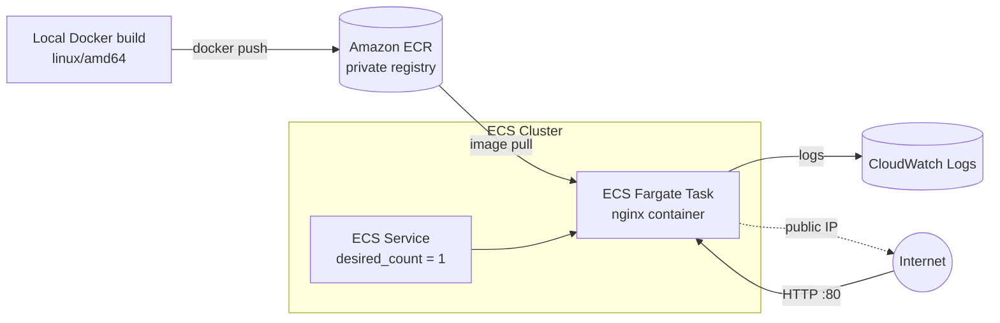

# AWS ECS Fargate — Containerized Web App Deployment

Migrating a small homelab web app off aging on-prem hardware onto a resilient, fully-managed container platform on AWS — provisioned end-to-end with Terraform.

---

## The Problem

A small internal web app had been running on a single VM on an aging Dell Optiplex in my homelab. It worked, but it carried an obvious risk: one box, one VM, one point of failure. If the hardware died, so did the app.

The goal of this project was to move that workload to a platform where the app is containerized, runs without a server for me to patch or keep alive, and is automatically replaced if it crashes — all defined as code so it can be torn down and rebuilt on demand.

---

## Architecture



The image is built locally, pushed to a private ECR repository, and run as a Fargate task managed by an ECS service. The service keeps one task running and replaces it if it stops. Logs stream to CloudWatch. For this iteration the task is reachable directly via a public IP (no load balancer) — see *What's Next* for the ALB upgrade.

---

## Tech Stack

- **Compute:** AWS ECS on Fargate (serverless containers — no EC2 hosts to manage)
- **Registry:** Amazon ECR (private)
- **Logging:** Amazon CloudWatch Logs
- **Identity:** AWS IAM (task execution role)
- **IaC:** Terraform (`~> 5.0` AWS provider)
- **Container:** Docker + nginx

---

## What Gets Built

A single `terraform apply` provisions 7 resources:

| Resource | Role |
|---|---|
| `aws_ecs_cluster` | Logical grouping for tasks |
| `aws_ecs_task_definition` | The task "manifest" — image, CPU/memory, roles, logging |
| `aws_ecs_service` | Keeps one task running; replaces it on failure |
| `aws_security_group` | Allows inbound HTTP :80; outbound for ECR pull |
| `aws_cloudwatch_log_group` | Destination for container logs |
| `aws_iam_role` | Task execution role |
| `aws_iam_role_policy_attachment` | Grants ECR-pull + CloudWatch-write to the role |

VPC and subnets are looked up (not created) — this iteration uses the account's default VPC.

---

## Prerequisites

- AWS account with **IAM Identity Center** configured (no static access keys)
- AWS CLI v2 with an SSO profile
- Terraform `>= 1.5`
- Docker
- An ECR repository (`aws ecr create-repository --repository-name my-nginx`)

---

## Deployment

### 1. Build the image — *for the right architecture*

Built on an Apple Silicon (arm64) Mac, so the target platform is set explicitly:

```bash
docker build --platform linux/amd64 -t my-nginx .
```

### 2. Authenticate and push to ECR

```bash
aws ecr get-login-password --region us-east-1 --profile lanebench \
  | docker login --username AWS --password-stdin <ACCOUNT_ID>.dkr.ecr.us-east-1.amazonaws.com

docker tag my-nginx:latest <ACCOUNT_ID>.dkr.ecr.us-east-1.amazonaws.com/my-nginx:latest
docker push <ACCOUNT_ID>.dkr.ecr.us-east-1.amazonaws.com/my-nginx:latest
```

### 3. Provision with Terraform

```bash
terraform init
terraform fmt
terraform validate
terraform plan      # expect: Plan: 7 to add, 0 to change, 0 to destroy
terraform apply
```

### 4. Find the task's public IP

Fargate assigns the public IP at runtime to the task's network interface, so it takes a short chain to retrieve:

```bash
TASK_ARN=$(aws ecs list-tasks --cluster my-nginx-cluster --service-name my-nginx-service \
  --region us-east-1 --profile lanebench --query 'taskArns[0]' --output text)

ENI_ID=$(aws ecs describe-tasks --cluster my-nginx-cluster --tasks $TASK_ARN \
  --region us-east-1 --profile lanebench \
  --query 'tasks[0].attachments[0].details[?name==`networkInterfaceId`].value' --output text)

aws ec2 describe-network-interfaces --network-interface-ids $ENI_ID \
  --region us-east-1 --profile lanebench \
  --query 'NetworkInterfaces[0].Association.PublicIp' --output text
```

Open `http://<PUBLIC_IP>` in a browser to see the page.

### 5. Tear down

```bash
terraform destroy
```

(The ECR image is not managed by this Terraform state, so it persists for re-deploys.)

---

## Project Structure

```
aws-ecs-fargate/
├── .gitignore
├── Dockerfile
├── index.html
├── providers.tf      # provider + version pinning
├── main.tf           # data lookups, IAM, log group, cluster, task def, SG, service
└── outputs.tf        # cluster + service names
```

---

## Troubleshooting Encountered

The real value of the build was in the errors, not the happy path.

**1. `exec format error` on first deploy (architecture mismatch).**
The image was built on an Apple Silicon Mac (arm64), but Fargate runs x86_64 by default — two incompatible processor instruction sets. Fixed by building with `--platform linux/amd64`, and documented in the task definition via a `runtime_platform` block declaring `X86_64` so any future mismatch fails loudly instead of cryptically.

**2. Task execution role vs. task role.**
Fargate uses two distinct IAM roles: the **execution role** (used by ECS itself to pull the image and write logs) and the **task role** (the app's own runtime permissions). This project intentionally omits the task role because nginx makes no AWS API calls. Conflating the two is the classic reason a first deploy won't start.

**3. Egress rule required for ECR image pull.**
The task's security group needs outbound access so ECS can pull the image from ECR on startup. Locking egress down too tightly prevents the container from ever launching.

**4. No stable public IP with Fargate.**
A Fargate service does not expose the task's public IP as a Terraform output — it's assigned to the ENI at runtime and changes on each deploy. This is the core motivation for adding an Application Load Balancer (a stable DNS name) as the next step.

---

## Cost

This architecture is near-zero and is torn down after each session.

| Item | Approx. cost |
|---|---|
| Fargate task (0.25 vCPU / 0.5 GB) | ~$0.012 / hour while running |
| ECR storage (small nginx image) | ~$0.02 / month |
| CloudWatch Logs (7-day retention) | Negligible |

Running resources are destroyed with `terraform destroy` when not in use.

---

## What's Next

- **Application Load Balancer** — a stable DNS name + health checks, replacing the runtime public IP.
- **Custom VPC with private subnets** — tasks in private subnets behind the ALB (the production pattern; this build uses the default VPC for simplicity).
- **HTTPS via ACM** — TLS termination at the load balancer.
- **ECR lifecycle policy** — auto-expire untagged images to control storage.
- **Parameterize with variables** — region, image tag, and sizing as `variables.tf` inputs.
- **CI/CD with GitHub Actions** — build, push, and deploy on commit.

---

## A Note on Tooling

I use AI tools as a learning aid throughout these projects — to pressure-test my understanding of *why* each piece works and to move faster — but every resource here was deployed, broken, and fixed by hand in my own AWS account.
